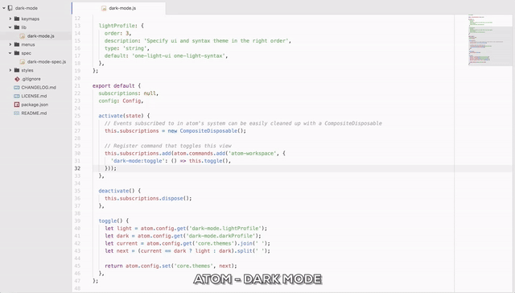

# Dark Mode

Package for Atom Editor which allow you to switch to `dark mode` and `light mode` theme.

## How to use?
Use shortcut:
> ctrl + \`

or in command palette choose `Dark Mode: Toggle`

## Customization
Go to the package config in Atom settings.

You can specify your own custom theme for each mode and use it as fast theme switcher.
